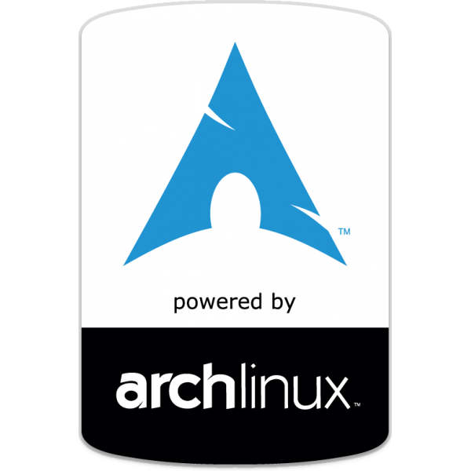

# Tengerid Home

| OS         | Term  | Shell | FM     | TE    | MX   | WM  | Server  |
| ---        | ---   | ---   | ---    | ---   | ---  | --- | ---     |
| Arch Linux | URxvt | Fish  | Ranger | [Vim] | Tmux | i3  | FreeBSD |

[GFM](https://en.wikipedia.org/wiki/Markdown "GitHub Flavored Markdown") supports tables, like in [Org](https://en.wikipedia.org/wiki/Org-mode) mode.

## See Also

[DRAFT.md](DRAFT.md) - Tengerid Stack

---

Written *in* [Markdown](http://daringfireball.net/projects/markdown/) _on_ [Vim](http://vim.org/) _for_ [Arch Linux](https://archlinux.org/) _with_ **pleasure**.

[Vim]: https://en.wikipedia.org/wiki/Vim (text editor)
